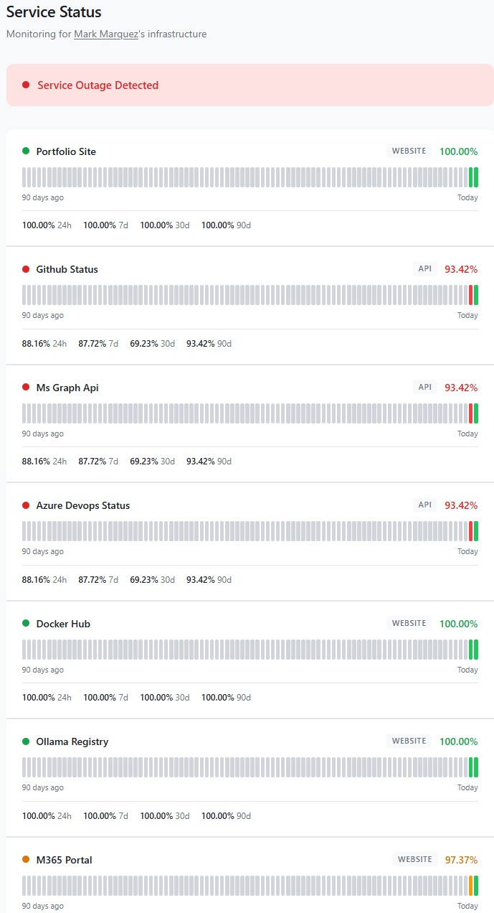
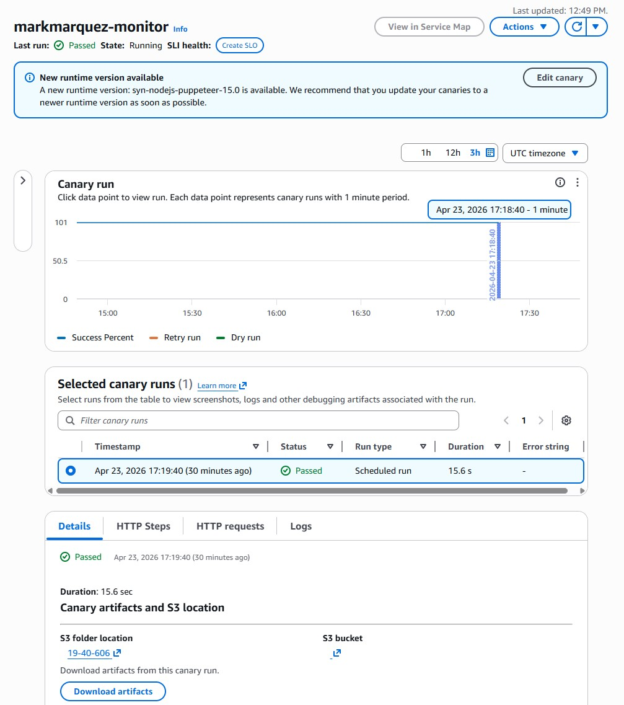
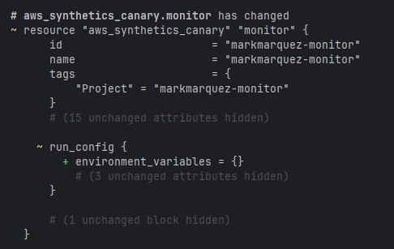
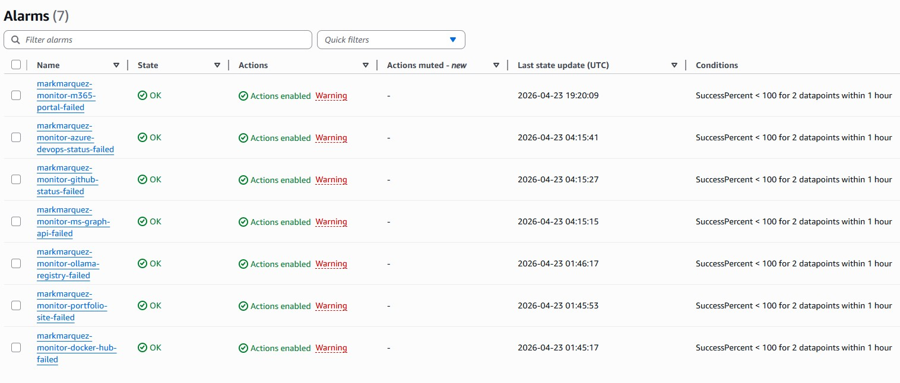

# CloudWatch Infrastructure Monitor

A lightweight, budget-friendly infrastructure monitoring system built on AWS CloudWatch Synthetics and managed entirely with Terraform. A single canary checks 7 endpoints every 30 minutes, CloudWatch Alarms trigger email alerts on failures, and a public status page shows real-time uptime history.

**Live status page:** [status.markandrewmarquez.com](https://status.markandrewmarquez.com)  
**Monthly cost:** ~$1.73 (single canary at 30-min intervals; Lambda, S3, CloudFront, and CloudWatch fall within free tier)



---

## What It Monitors

| Endpoint | URL | Check Type |
|----------|-----|------------|
| Portfolio Site | `markandrewmarquez.com` | Website (HTTP 200) |
| GitHub Status | `githubstatus.com/api/v2/status.json` | API (validates JSON structure) |
| MS Graph API | `graph.microsoft.com/v1.0/$metadata` | API (validates XML schema) |
| Azure DevOps Status | `status.dev.azure.com/_apis/status/health` | API (validates JSON `status` field) |
| Docker Hub | `hub.docker.com` | Website (HTTP 200) |
| Ollama Registry | `registry.ollama.ai` | Website (HTTP 200) |
| M365 Portal | `office.com` | Website (HTTP 200) |

To add, remove, or change endpoints, edit the `monitors` list in `variables.tf` and run `terraform apply`. Terraform handles the rest — canary script, alarms, and dashboard all update automatically.

---

## Architecture

```
CloudWatch Synthetics Canary (every 30 min)
│
│  executeHttpStep() × 7 endpoints
│  Each step emits its own SuccessPercent metric
│
├──▶ CloudWatch Alarms (1 per endpoint)
│       │
│       └──▶ SNS ──▶ Email alert (failure + recovery)
│
└──▶ Lambda (every 5 min)
        │
        └──▶ Queries CloudWatch metrics
             └──▶ Writes status.json to S3
                  └──▶ CloudFront ──▶ status.markandrewmarquez.com
```

### Why one canary instead of seven?

CloudWatch Synthetics charges per canary, not per check. By running all endpoints as separate `executeHttpStep()` calls inside a single canary, each endpoint still gets its own `SuccessPercent` metric and its own CloudWatch Alarm — but the bill stays at ~$1.73/month instead of ~$12.



---

## Prerequisites

- [Terraform](https://developer.hashicorp.com/terraform/install) ≥ 1.5
- [AWS CLI](https://docs.aws.amazon.com/cli/latest/userguide/install-cliv2.html) with credentials configured
- An AWS account with permissions for S3, IAM, Lambda, CloudWatch, CloudFront, ACM, and Synthetics

```powershell
# Install (Windows)
winget install Hashicorp.Terraform
winget install Amazon.AWSCLI

# Restart your terminal after installing, then verify
terraform -version
aws --version
aws sts get-caller-identity
```

---

## Deployment

### 1. Configure variables

```powershell
copy terraform.tfvars.example terraform.tfvars
```

Edit `terraform.tfvars` and set your email address. This file is gitignored — your email stays out of version control.

### 2. Initialize and deploy

```powershell
terraform init
terraform plan    # Review what will be created
terraform apply   # Type "yes" to deploy
```



### 3. Add the ACM validation DNS record (during apply)

> **This is the step most likely to trip you up.** Terraform will pause and wait while it validates the SSL certificate. Don't panic — it's waiting for you to add a DNS record.

When `terraform apply` reaches the ACM certificate validation, it will appear to hang. While it waits:

1. Look for the `dns_1_acm_validation_record` output in your terminal — it shows the CNAME **name** and **value**
2. Go to [GoDaddy DNS Management](https://dcc.godaddy.com/manage-dns)
3. Add a **CNAME** record with exactly those values
4. Wait 1–5 minutes for DNS propagation
5. Terraform detects the validation automatically and continues the apply

### 4. Add the status page CNAME (after apply)

After `terraform apply` finishes:

1. Find the `dns_2_status_page_cname` output — it shows the CloudFront distribution domain
2. In GoDaddy, add another **CNAME** record:
   - **Name:** `status`
   - **Value:** the CloudFront domain from the output (e.g., `d1234abcd.cloudfront.net`)

### 5. Confirm the SNS email subscription

AWS sends a confirmation email to the address in `terraform.tfvars` after the first apply. **You must click the confirmation link** or alarm notifications will not be delivered.


### 6. Verify everything is running

- **Canary:** [CloudWatch Synthetics console](https://console.aws.amazon.com/cloudwatch/home?region=us-east-1#synthetics:canary/list) — look for a green "Running" status
- **Dashboard:** Run `terraform output dashboard_url` and open the link
- **Status page:** Visit [status.markandrewmarquez.com](https://status.markandrewmarquez.com)



---

## Adding or Removing Endpoints

Edit the `monitors` list in `variables.tf`:

```hcl
variable "monitors" {
  default = [
    {
      name = "my-new-service"
      url  = "https://example.com/health"
      type = "api"      # "website" (HTTP 200 check) or "api" (validates response body)
    },
    # ... existing endpoints ...
  ]
}
```

Then:

```powershell
terraform plan    # Review what changes
terraform apply   # Deploy
```

Terraform automatically updates the canary script, creates or removes CloudWatch Alarms, and updates the dashboard to match.

---

## Project Structure

```
cloudwatch-monitor/
├── main.tf                  # Terraform + AWS provider config
├── variables.tf             # Endpoints, interval, email, domain settings
├── canary.tf                # S3 artifacts bucket, IAM role, Synthetics canary
├── alarms.tf                # SNS topic + per-endpoint CloudWatch Alarms
├── status-page.tf           # S3, CloudFront, ACM cert, Lambda, EventBridge
├── dashboard.tf             # CloudWatch dashboard (metrics visualization)
├── outputs.tf               # Console URLs, DNS instructions, status page URL
├── terraform.tfvars.example # Template for sensitive variables (safe to commit)
├── .gitignore               # Excludes state files, secrets, build artifacts
├── canary-script/
│   └── index.js.tftpl       # Canary script template (Terraform renders at deploy)
├── images/
│   ├── status-page.jpg      # Public status page with all endpoints
│   ├── canary-console.jpg   # Synthetics canary detail + success rate graph
│   ├── terraform-apply.jpg  # Terminal output after a successful apply
│   ├── alarm-email.jpg      # Example SNS alarm notification email
│   └── cloudwatch-alarms.jpg # CloudWatch Alarms list in OK state
└── status-page/
    ├── index.html            # Public status page (static HTML/CSS/JS)
    └── generate-status.py    # Lambda function: CloudWatch metrics → status.json
```

---

## Troubleshooting

**Canary shows "Error" in the console**  
Check the canary's CloudWatch Logs at `/aws/lambda/cwsyn-<canary-name>-*`. The most common cause is a timeout — the default 120-second timeout should be plenty for HTTP checks, but a slow endpoint can trigger it.

**Not receiving alarm emails**  
Make sure you clicked the SNS subscription confirmation link. Check your spam folder. You can verify the subscription status in the [SNS console](https://console.aws.amazon.com/sns/v3/home?region=us-east-1#/subscriptions) — the status should say "Confirmed".

**`terraform apply` hangs at ACM certificate**  
This is expected — see Step 3 above. Terraform is waiting for DNS validation. Add the CNAME record in GoDaddy and give it a few minutes.

**Status page shows "Access Denied"**  
The CloudFront distribution may still be deploying (takes 5–15 minutes after the first apply). If it persists, verify the S3 bucket policy allows CloudFront OAC access.

**Canary passes but alarm is firing**  
Check the alarm's `treat_missing_data` setting. Alarms are configured to treat missing data as breaching — if the canary didn't run (e.g., during a deployment), the alarm fires. It will auto-resolve on the next successful run.

---

## Tear Down

To remove all AWS resources created by this project:

```powershell
terraform destroy
```

Terraform will show you everything it's about to delete. Type `yes` to confirm. After destruction:

- Remove the two CNAME records from GoDaddy DNS (ACM validation + status page)
- The S3 buckets are set to `force_destroy = true`, so Terraform handles object cleanup automatically

---

## Security

This is a public repository. Sensitive information is kept out of version control:

- **AWS credentials** live in `~/.aws/credentials` on the local machine — never in the repo
- **`terraform.tfvars`** (contains the alert email) is gitignored
- **`*.tfstate` files** (contain account IDs and resource ARNs) are gitignored
- **S3 artifact buckets** have public access fully blocked

---

## License

MIT
